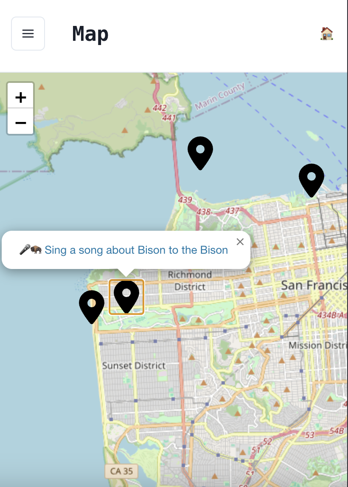

# Scavenger Hunt Web Application

A self-hosted scavenger hunt web application via Dokku. Assign your friends into teams and have them complete challenges across your city of choice!


Features include:
- Interactive map visualization of challenges and real-time team locations via emojis.
- Challenges where teams submit video evidence of challenge completion.
- A feed where teams can see all submissions and whether the submission is approved, pending review, or rejected.
- A team points leaderboard with a CTF-style line graph visualization.

Created by @cablej, @aivantg, and @drewgregory.

**Note**: Some of the visual elements are somewhat San Francisco-specific.

# Dev Setup

## (Optional) Set up devcontainer

Want an isolated development package install that doesn't affect your host namespace? Open this repo in a dev container!

Create a DevContainer for VSCode via [this tutorial](https://code.visualstudio.com/docs/devcontainers/tutorial).

1. Create a dev container 

https://code.visualstudio.com/docs/devcontainers/containers#_quick-start-open-an-existing-folder-in-a-container

CMD+SHIFT+P => "Reopen in container"

## Run development server (from terminal in host, not in devcontainer)

**Note**: These development servers are running on 0.0.0.0, so they may be accesible on your LAN.

Run a development web server and mongo server locally in Docker containers. *Note*: these containers are run separately from the development container.

```
$ docker compose up --build
```

## Initialize .env.local

Initialize a `.env.local`:

```
cp .env.example .env.local
```

And fill out the environment variables accordingly:

### ADMIN_ID

The ObjectId for the team you want to be able to approve and reject submissions in the submission feed. See **Load example data** for more information.

### END_TIME_ISO_STRING

The end time of the scavenger hunt in the form of an ISO string.

### MONGO_URL

The connection string to the mongo server. For local development, `mongodb://localhost:27017/database`

### SPACES_BUCKET_NAME

The [Digital Ocean Spaces Bucket name](https://www.digitalocean.com/products/spaces) that hosts the submission video files. Alternatively, the bucket name of an AWS S3-compliant object storage system (but you will have to make code changes to server the video files). Be careful to configure it so that it the bucket isn't [publicly listable](https://docs.digitalocean.com/products/spaces/how-to/set-file-listing-permissions/), as we set the objects to be publicly readable and rely on the object key not being guessable. Otherwise, the public internet could view your scavenger hunt video submissions.

### SPACES_ENDPOINT

The [Digital Ocean Spaces Endpoint](https://docs.digitalocean.com/reference/api/spaces-api/).

### SPACES_KEY

The [Digital Ocean Spaces Key Name](https://docs.digitalocean.com/products/spaces/how-to/manage-access/).

### SPACES_REGION

The [Digital Ocean Spaces Region](https://docs.digitalocean.com/products/spaces/details/availability/). Make sure it is consistent with `SPACES_ENDPOINT` by making sure that the matching region code is present in the endpoint.

### SPACES_SECRET

The [Digital Ocean Spaces Key Secret](https://docs.digitalocean.com/products/spaces/how-to/manage-access/) that corresponds to `SPACES_KEY`.

### START_TIME_ISO_STRING

The scavenger hunt start time in the form of an ISOString.

## Load example data

Fill out a `challenges.csv` and `teams.csv` in `scripts`. Let's use the example for now:

```
cp scripts/example_challenges.csv scripts/challenges.csv
cp scripts/example_teams.csv scripts/teams.csv
```

Note the team names and begin codes. You will need to distribute these team codes to allow users of that team to sign in via `http://localhost/begin/<team code here>` (of course, replace these team code)

In additon, pick the team that you want to be the "admin team" (which can approve or reject submissions), and take a note of the ID

Run this within the devcontainer:

```
$ MONGO_URL=mongodb://localhost:27017/database npx ts-node -T scripts/perform-migration.ts
```

# Dokku Deployment

## Register a hostname.

Register a hostname. We recommend [Namecheap](https://www.namecheap.com/). Let's assume that the hostname is "myhostname.com".

## Set up Dokku on a DigitalOcean Droplet

Follow [these instructions](https://dokku.com/docs/getting-started/install/digitalocean/) to set up Dokku on a DigitalOcean droplet. Note the Dokku app name that hosts the web server. If using the [DigitalOcean marketplace droplet](https://marketplace.digitalocean.com/apps/dokku), the app will be `node-js-app`.

## Written for DigitalOcean

We used DigitalOcean for our Dokku deployment. This project could in theory run in another cloud provider, but the instructions may vary slightly.

## Initial Setup

1. Follow [instructions](https://dokku.com/docs/networking/proxies/nginx/#default-site) to turn off the default nginx site and instead have nginx route to our app. In particular, run from within the Dokku host:
    ```
    $ rm /etc/nginx/sites-enabled/default
    dokku nginx:stop
    dokku nginx:start
    ```
1. Add ssh key (.pub file) from local machine to Dokku host via scp to ~/.ssh
    ```
    $ scp -i ~/.ssh/<key to access Dokku host> ~/.ssh/<git SSH key> root@<dokku host>:~/.ssh/<git SSH key>.pub
    ```
1. Run `dokku ssh-keys:add <git SSH key> path/to/your/public_key.pub` from within the Dokku host
1. Set up your SSH config on your lcaol machine with the following host entry
```
Host myhostname.com
  Hostname myhostname.com
  User root
  IdentityFile ~/.ssh/id_<identity_file>
```

## Add dokku git remote

```
$ git remote add dokku dokku@myhostname.com:node-js-app
$ git push dokku main
```

## Create a TLS Cert
Follow [these instructions](https://dokku.com/docs/configuration/ssl/) to set up the TLS configuration on the dokku end. We'll use [the LetsEncrypt plugin](https://github.com/dokku/dokku-letsencrypt).

```
$ ssh myhostname.com
$ dokku domains:remove node-js-app node-js-app.myhostname.com
$ sudo dokku plugin:install https://github.com/dokku/dokku-letsencrypt.git
$ dokku letsencrypt:set --global email <your email>
$ dokku letsencrypt:enable
```

Certs will be present at ls /home/dokku/node-js-app/letsencrypt/certs/. Be sure to save them for safekeeping off the droplet via `scp`!

## Creating the database

1. Install the dokku mongo plugin
```
$ ssh myhostname.com
$ sudo dokku plugin:install https://github.com/dokku/dokku-mongo.git mongo
```
1. Create the db
```
$ ssh myhostname.com
dokku mongo:create scavhuntdb
dokku mongo:link scavhuntdb node-js-app
```

## Connect to the production database
To test that the database is up and running, try connecting to it from your Dokku droplet.
```
$ ssh myhostname.com
$ dokku mongo:connect scavhuntdb
```

You should see a `mongosh` session open.

## Resize the Droplet

You may want to resize the droplet's storage, CPU, and/or RAM. For example, we recommend allocating at least 4GB of RAM so that the NextJS build has enough RAM to build the web app. Before resizing, you should try to safely shutdown the droplet.

1. Shutdown the droplet
```
$ ssh myhostname.com
$ sudo shutdown -h now
```
1. Follow [this process](https://docs.digitalocean.com/products/droplets/how-to/resize/)
1. Start up dokku again
```
$ ssh myhostname.com
$ dokku ps:restart node-js-app
```

## Create DB migration app

To run database migrations (like initializing the teams and challenges) on the production database using our `perform-migration.ts` typescript script, create an app that only is used for running database migrations.

```
$ ssh myhostname.com
$ dokku apps:create scavhuntdb-migrations
$ dokku mongo:link scavhuntdb scavhuntdb-migrations
$ dokku builder-dockerfile:set scavhuntdb-migrations dockerfile-path Dockerfile.migrations
$ dokku config:set scavhuntdb-migrations DOKKU_SKIP_DEPLOY=true
$ 
$ exit
$ git remote add dokku-migrations dokku@myhostname.com:scavhuntdb-migrations
```

## Run DB Migration

```
$ git push dokku-migrations main
$ ssh myhostname.com "dokku run scavhuntdb-migrations npx ts-node -T scripts/perform-migration.ts"
```

## Set max body size

When users upload video files to complete challenge, they will quickly exceed the default 1 MiB size limit and experience HTTP 413 status codes before the request hits our Dokku NextJS app. This is because Dokku configures a Nginx proxy with a default max body size of 1MiB. You should reset that variable accordingly:
```
$ ssh myhostname.com
$ dokku nginx:set scavhunt client-max-body-size 200m
$ dokku proxy:build-config --all
```

This example specifies a limit of 200MB, but you may want to further increase the limit. Note that this limit shouldn't affect our RAM usage since the file upload code uses NodeJS read streams.

## Set environment variables

You will have to specify environment variables in a similar way to how you specified them via `.env.local`. Instead of via `.env` files, however, we will be specifying them [via Dokku commands](https://dokku.com/docs/configuration/environment-variables/):

**Note**: You do not have to specify the `MONGO_URL` environment variable since it is already set.

```
$ ssh myhostname.com
$ dokku config:set node-js-app ENV_VAR_NAME=ENV_VAR_VALUE
```

