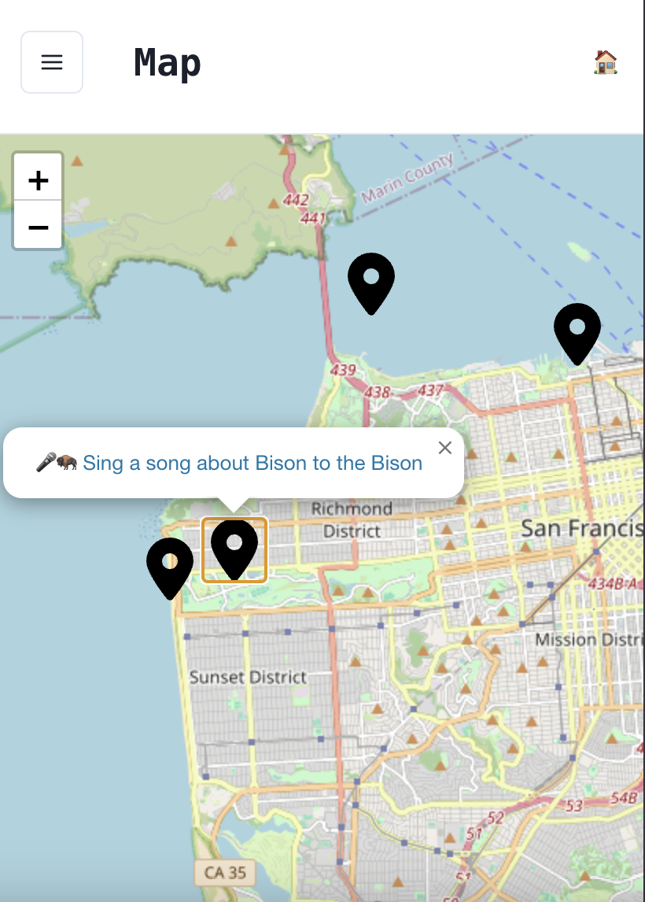

# Scavenger Hunt Web Application

A self-hosted scavenger hunt web app (Dokku-friendly). Players sign up with phone/email
verification (Bird), get assigned to teams, submit challenge videos, vote in a
neighborhood tournament, and compete on a points leaderboard.



Features:
- User accounts with Bird SMS/email OTP (no team-code login)
- Admin dashboard to manage users, teams, challenges, and the tournament
- Interactive map of challenges and live team locations
- Video challenge submissions + feed with favorites
- Team points leaderboard with a CTF-style line graph
- Neighborhood tournament bracket (collective voting)

Created by @cablej, @aivantg, and @drewgregory.

**Note**: Some visual elements are San Francisco-specific.

## Dev setup

### 1. Start Postgres

```bash
docker compose up -d db
```

Local compose maps host port **5434** → container 5432.

### 2. Env file

```bash
cp .env.example .env.local
```

Fill in at least:

| Variable | Purpose |
|---|---|
| `DATABASE_URL` | Postgres connection string |
| `SESSION_SECRET` | Long random string for signed cookies |
| `ADMIN_EMAILS` | Comma-separated emails that become admins on login |
| `APP_ORIGIN` | Public origin (e.g. `http://localhost:80`) for CSRF checks |
| `START_TIME_ISO_STRING` / `END_TIME_ISO_STRING` | Hunt window |
| `BIRD_API_KEY` / `BIRD_API_HOST` | Bird Verify (or leave `BIRD_MOCK=true` locally) |
| `SPACES_*` | DigitalOcean Spaces / S3 uploads |

With `BIRD_MOCK=true`, OTP codes are always `000000`.

### 3. Install, migrate, seed

```bash
pnpm install
pnpm db:migrate
pnpm db:seed
```

Seed creates 16 placeholder neighborhoods, a round-1 bracket, and optionally
imports `scripts/example_challenges.csv` if present.

### 4. Run the app

```bash
# App only (DB already running via compose)
pnpm dev

# Or full stack
docker compose up --build
```

Open `http://localhost` (dev server binds port 80).

### Optional: Devcontainer

CMD+SHIFT+P → "Reopen in Container" if you want an isolated install.

## Auth flow

1. **Sign up** at `/signup` with name, email, phone → Bird OTP → account created
2. **Log in** at `/login` with phone or email → Bird OTP → session cookie
3. Admins listed in `ADMIN_EMAILS` get `isAdmin` on successful auth
4. Admins assign users to teams from `/admin`

## Tournament

After login, `/` links into the neighborhood bracket. Everyone votes once per
matchup. Admins close a round from the Admin → Tournament tab to advance winners.

## Dokku deployment

1. Create/link a Postgres service (Dokku postgres plugin) instead of Mongo
2. Set the env vars from `.env.example` via `dokku config:set`
3. Push the app; the Docker image runs `prisma migrate deploy` on start
4. Seed once: `dokku run <app> pnpm db:seed`
5. Keep nginx `client-max-body-size` high enough for video uploads

```bash
dokku postgres:create scavhuntdb
dokku postgres:link scavhuntdb <app>
dokku config:set <app> SESSION_SECRET=... ADMIN_EMAILS=... APP_ORIGIN=https://your.host ...
git push dokku main
```

## Scripts

| Script | What it does |
|---|---|
| `pnpm dev` | Next.js on port 80 |
| `pnpm build` | `prisma generate` + Next build |
| `pnpm db:migrate` | Prisma migrate (dev) |
| `pnpm db:seed` | Neighborhoods + bracket (+ optional challenges CSV) |
| `pnpm db:studio` | Prisma Studio |
