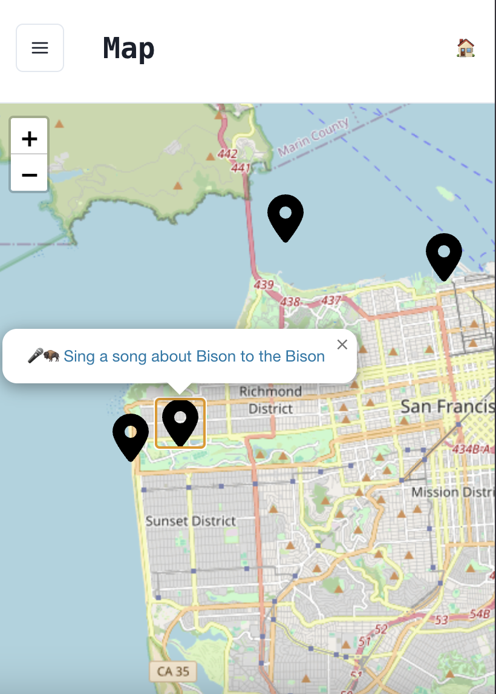

# Scavenger Hunt Web Application

A self-hosted scavenger hunt web app (Dokku-friendly). Players sign up with phone/email
verification (Bird), get assigned to teams, submit challenge videos, claim neighborhoods
on a territory map, and compete on a points leaderboard.



Features:
- User accounts with Bird SMS/email OTP (no team-code login)
- Admin dashboard to manage users, teams, challenges, and the map
- Interactive map of challenges, live team locations, and territory control
- Video challenge submissions + feed with favorites
- Team points leaderboard with a CTF-style line graph

Created by @cablej, @aivantg, and @drewgregory.

**Note**: Some visual elements are San Francisco-specific.

## Dev setup

### 1. Start Postgres

```bash
docker compose up -d db
```

Local compose maps host port **5434** → container 5432.

### 2. Env file

```bash
cp .env.example .env.local
```

Fill in at least:

| Variable | Purpose |
|---|---|
| `DATABASE_URL` | Postgres connection string |
| `SESSION_SECRET` | Long random string for signed cookies |
| `ADMIN_EMAILS` | Comma-separated emails that become admins on login |
| `APP_ORIGIN` | Public origin (e.g. `http://localhost:80`) for CSRF checks |
| `START_TIME_ISO_STRING` / `END_TIME_ISO_STRING` | Hunt window |
| `BIRD_API_KEY` / `BIRD_API_HOST` | Bird Verify (or leave `BIRD_MOCK=true` locally) |
| `SPACES_*` | DigitalOcean Spaces / S3 uploads |

With `BIRD_MOCK=true`, OTP codes are always `000000`.

### 3. Install, migrate, seed

```bash
pnpm install
pnpm db:migrate
pnpm db:seed
```

Seed ensures hunt settings and optionally imports `scripts/sample_challenges.csv`
if present.

### 4. Run the app

```bash
# App only (DB already running via compose)
pnpm dev

# Or full stack
docker compose up --build
```

Open `http://localhost` (dev server binds port 80).

### Optional: Devcontainer

CMD+SHIFT+P → "Reopen in Container" if you want an isolated install.

## Auth flow

1. **Sign up** at `/signup` with name, email, phone → Bird OTP → account created
2. **Log in** at `/login` with phone or email → Bird OTP → session cookie
3. Admins listed in `ADMIN_EMAILS` get `isAdmin` on successful auth
4. Admins assign users to teams from `/admin`

## Dokku deployment

1. Create/link a Postgres service (Dokku postgres plugin) instead of Mongo
2. Set the env vars from `.env.example` via `dokku config:set`
3. Push the app; the Docker image runs `prisma migrate deploy` on start
4. Seed once: `dokku run <app> pnpm db:seed`

Uploads go direct from the browser to Spaces (multipart), so the app nginx
proxy does not need a raised `client-max-body-size` for media.

```bash
dokku postgres:create scavhuntdb
dokku postgres:link scavhuntdb <app>
dokku config:set <app> SESSION_SECRET=... ADMIN_EMAILS=... APP_ORIGIN=https://your.host ...
git push dokku main
```

## Media storage & CDN

Media lives in DigitalOcean Spaces. New uploads store **CDN** URLs
(`https://{bucket}.{region}.cdn.digitaloceanspaces.com/...`); `serializeSubmission`
rewrites any legacy origin URLs to the CDN host at read time.

**Spaces control panel**

1. Enable the CDN for the bucket and set the edge TTL to the maximum.
2. CORS: allow `GET`, `PUT`, `HEAD` from the app origin, and expose `ETag`
   (Uppy multipart needs it for part completion).
3. Lifecycle: expire the `sandbox/` prefix after 14 days (admin Upload testing
   page writes there). Example:

```json
{
  "Rules": [
    {
      "ID": "expire-sandbox-14d",
      "Status": "Enabled",
      "Filter": { "Prefix": "sandbox/" },
      "Expiration": { "Days": 14 }
    }
  ]
}
```

```bash
aws s3api put-bucket-lifecycle-configuration \
  --bucket "$SPACES_BUCKET_NAME" \
  --endpoint-url "https://${SPACES_REGION}.digitaloceanspaces.com" \
  --lifecycle-configuration file://lifecycle.json
```

**Upload testing (admin → Upload testing, `/admin/upload-testing`)** runs a
picked or recorded file through the real production pipeline (compression,
Uppy multipart, poster) with any `UploadConfig`, plus optional chaos (failed
signs/PUTs, pause, simulated offline). It shows a part waterfall, concurrency,
throughput, compression stats and origin-vs-CDN download / first-frame
benchmarks, and saves runs to `UploadTestRun` (soft delete). Objects go to
`sandbox/{userId}/{runId}/` only (admin-only on the server; no submissions are
created) and rely on the lifecycle rule above for cleanup. "Apply as production
default" stores the config in `HuntSettings.uploadConfig`, which players pick
up via `/api/upload-config`; "Reset" falls back to `lib/upload/config.ts`.
Download benchmarks need the bucket CORS to allow `GET` from the app origin.

**Backfill immutable Cache-Control** on existing objects (new uploads already
set `public, max-age=31536000, immutable`):

```bash
pnpm exec tsx scripts/backfill-cache-control.ts --dry-run
pnpm exec tsx scripts/backfill-cache-control.ts
# optional: --prefix=submissions/
```

## Scripts

| Script | What it does |
|---|---|
| `pnpm dev` | Next.js on port 80 |
| `pnpm build` | `prisma generate` + Next build |
| `pnpm db:migrate` | Prisma migrate (dev) |
| `pnpm db:seed` | Hunt settings (+ optional challenges CSV) |
| `pnpm db:studio` | Prisma Studio |
| `pnpm exec tsx scripts/backfill-cache-control.ts` | Set immutable Cache-Control on existing Spaces objects |
